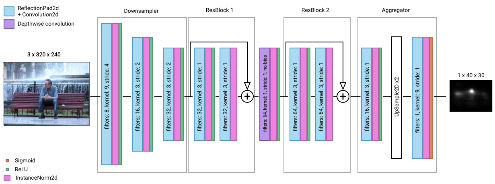

# Glimpse

A content-aware cropping library (backstage)

We would not be 100% open source if we didn't also share our Deep Learning model with you, so... here it is!  
If you just want to get a quick glance at the model architecture just go to [inference.ipynb](pytorch/inference.ipynb) 
and check it out, also there you can see the model output and a small benchmark on it's latency on my computer 
(9ms with 86% accuracy, if you're wondering).

We currenty only have a PyTorch based architecture, but we're planing on adding a Keras version.

## Don't be shy

We'd love to hear your proposals for improving the architecture, increasing the dataset 
(maybe we could train domain specific models for faces, or food, or animals) or whatever, 
so feel free to create an issue with your improvement ideas, or fork this repository and send us a Pull Request!! 

## Client-side implementations
[Android](https://github.com/the-super-toys/glimpse-android-client)

## Credits model
In order to build Glimpse model we took inspiration from several papers:
* [Faster gaze prediction with dense networks and Fisher pruning](https://arxiv.org/abs/1801.05787)
* [Deep Residual Learning for Image Recognition](https://arxiv.org/abs/1512.03385)
* [Instance Normalization: The Missing Ingredient for Fast Stylization](https://arxiv.org/abs/1607.08022)

## Credits dataset
The dataset used for both training and validation is openly available on [salicon web](http://salicon.net/). In order to consume the images of the
dataset and generate the associated heatmaps we used [salicon-api](https://github.com/NUS-VIP/salicon-api), which is contained in the [PythonApi](https://github.com/the-super-toys/glimpse-models/tree/master/data-prepare/PythonAPI) module of this repository.